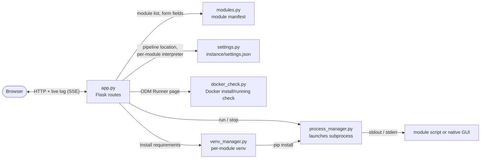

# MatchPlant Dashboard


A local web front end for the [MatchPlant](https://github.com/JacobWashburn-USDA/MatchPlant) pipeline,
included in this repository as the `dashboard/` folder.
Landing page: **[matchplant-dashboard.github.io](https://matchplant-dashboard.github.io)**.

- Lists all 10 pipeline modules
- Launch a module's native GUI, or run its CLI/script with real arguments
- Live log output streamed to the browser
- Downloaded together with the pipeline modules; the dashboard finds them automatically since they live in the same repository
- Runs entirely on your own machine. GUI modules (GCP Finder, BBox Drawer, etc.) open a native Tkinter window on the machine running the dashboard, so don't deploy this to a remote server and expect the GUI to appear in your browser

## Setup

**No terminal experience? Double-click these files** in this folder, in order:

1. `setup.command` (Windows: `setup.bat`): checks for Python, tells you what to install if it's missing, and sets everything up. One-time only.
2. `start_dashboard.command` (Windows: `start_dashboard.bat`): starts the dashboard and opens it in your browser automatically. Run this every time you want to use the dashboard; keep its window open while you use it.

**Prefer the terminal?** Run the setup script. It checks for Python, tells you what to install if it's missing, and does the rest for you:

```bash
./setup.sh          # Windows: setup.bat
```

Then start the dashboard:

```bash
./.venv/bin/python app.py     # Windows: .venv\Scripts\python app.py
```

Then open http://127.0.0.1:5050

**Already comfortable with Python/venvs?** The manual equivalent:

```bash
python -m venv .venv
source .venv/bin/activate      # Windows: .venv\Scripts\activate
pip install -r requirements.txt
python app.py
```

## Connecting to the MatchPlant pipeline

- Since `dashboard/` lives inside the MatchPlant repository, the dashboard finds the pipeline modules automatically, no setup needed
- If you ever move this folder somewhere else, or want to point it at a different MatchPlant checkout, the **Getting Started** page inside the dashboard has a **Browse...** button that opens a native folder picker to relocate it

## Per-module Python environments

- Modules have very different dependencies (Tkinter-only GUIs, PyTorch training, GDAL/rasterio geospatial code), so one environment usually can't satisfy all of them
- Each module page checks its own dependencies automatically and offers an **Install requirements** button that creates a dedicated environment for that module
- The **Settings** page lists which interpreter each module is using. Only needed if you already have a working environment (e.g. an existing PyTorch/CUDA setup) you'd rather point a module at instead

## Notes per module

- **ODM Runner** needs Docker Desktop running (the dashboard checks this live on that module's page), and needs a project folder path with an `images/` subfolder. Enter that path in the form; the script runs with that folder as its working directory.
- **Transfer Learning** has no command-line flags; edit `transfer_config.yaml` directly on its module page and save, then run.
- Modules with mac/win variants (GCP Finder, Min Image Finder, BBox Drawer, Image Splitter, Spatial Stats Extractor, ODM Runner) auto-select the script for your OS; a dropdown lets you override it.

## How it works



- `modules.py`: manifest of all pipeline modules, script location(s), kind (`gui`, `cli`, `config`, `shell`), and for CLI tools, the argparse-derived form fields. Resolves each module's folder against the MatchPlant pipeline location configured in Settings/Getting Started, not this dashboard's own folder.
- `process_manager.py`: launches each run as a subprocess and streams its stdout/stderr through a queue.
- `app.py`: Flask routes for the dashboard, module detail/form, run (`POST`), live log (`GET`, Server-Sent Events), and stop.
- `settings.py`: persists the MatchPlant pipeline location and per-module interpreter paths to `instance/settings.json` (not committed).
- `docker_check.py`: live Docker install/running check, used on the ODM Runner module page.
- `venv_manager.py`: creates a dedicated virtual environment per module (used by the **Install requirements** button), so one module's dependencies never collide with another's.
- `static/logo.png`, `static/images/img.png`: the dashboard's own bundled branding and pipeline-diagram assets (independent of wherever the MatchPlant pipeline is located).
